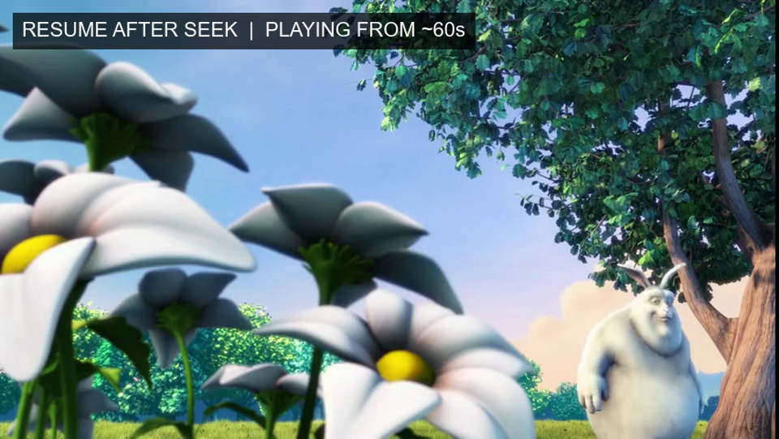
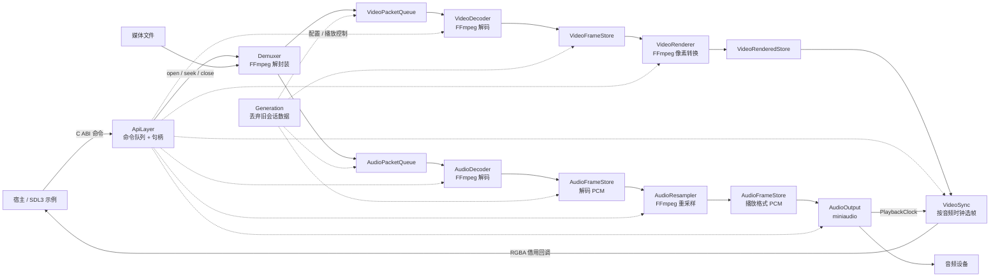

# SemiPlayer

[](https://github.com/Semiruyi/SemiPlayer/actions/workflows/windows-ci.yml)
[](https://github.com/Semiruyi/SemiPlayer/releases/latest)
[](LICENSE)

使用 C++23 编写的媒体播放器内核。SemiPlayer 将 FFmpeg 解封装与解码、
miniaudio 音频输出和音视频同步封装在动态库中，通过 C ABI 向桌面或跨语言宿主
提供异步播放能力；仓库同时包含一个基于 SDL3 的可运行示例。

[下载 Windows x64 便携版](https://github.com/Semiruyi/SemiPlayer/releases/download/v0.1.0/SemiPlayer-0.1.0-windows-x64-portable.zip)
· [查看 v0.1.0 Release](https://github.com/Semiruyi/SemiPlayer/releases/tag/v0.1.0)
· [阅读架构设计](docs/architecture.md)

## 64 秒演示

[](docs/assets/SemiPlayer-demo.mp4)

[下载 / 观看演示视频](docs/assets/SemiPlayer-demo.mp4)

演示流程：播放 → 暂停 → 在暂停状态下 Seek 到约 60 秒 → 保持暂停 → 恢复播放。
视频画面来自 SemiPlayer C ABI 的真实 RGBA 帧回调；演示素材为
[Big Buck Bunny](https://video.blender.org/w/dmhvQNzwBnrWy1iYzVv5g7)，
© Blender Foundation，采用 [CC BY 3.0](https://creativecommons.org/licenses/by/3.0/) 授权。

## 开箱运行

1. 下载并解压 Windows x64 便携包。
2. 双击 `bin/semi_player_sdl.exe`，程序会自动播放随包提供的 5 秒默认示例媒体。
3. 也可以把本地媒体文件拖到程序上，或在命令行中传入媒体路径。

```powershell
.\bin\semi_player_sdl.exe
.\bin\semi_player_sdl.exe D:\media\example.mp4
```

| 按键 | 功能 |
|---|---|
| 空格 | 播放 / 暂停 |
| ← / → | 向前 / 向后跳转 5 秒，落到相邻关键帧 |
| F11 | 切换全屏 |
| Esc | 退出 |

## 已实现能力

- FFmpeg 媒体探测、音视频分流、解码、音频重采样和视频像素格式转换。
- miniaudio 音频输出，以实际消费进度建立播放时钟。
- 视频根据音频主时钟选帧，并通过只读借用回调交给宿主显示。
- `open`、`play`、`pause`、关键帧 `seek`、`close` 和播放结束事件。
- C ABI 动态库与异步命令句柄，支持等待结果以及取消尚未开始的命令。
- SDL3 示例宿主，负责窗口、输入、帧上传、画面比例和全屏切换。
- Windows x64 便携发布包，自动收集运行库和对应的第三方许可证。

## 当前实现架构

控制面和数据面相互分离：宿主调用先进入 `ApiLayer` 的私有命令队列，由唯一命令
线程串行编排；音频和视频数据则沿各自的有界管道并行处理。



### 关键设计

- **异步 C ABI**：控制调用立即返回不透明句柄，耗时操作在播放器内部执行；宿主可
  `await` 结果，也可以取消仍在队列中等待的命令。
- **串行控制、并行数据**：`ApiLayer` 串行处理状态变更，避免跨命令竞争；解封装、
  解码、重采样、输出和视频同步分别由工作线程推进。
- **有界队列与背压**：PacketQueue 和 FrameStore 限制在途数据量，上游在下游饱和
  时自然等待，避免播放长媒体时内存持续增长。
- **世代号隔离**：新媒体会话或成功 Seek 后推进 `Generation`；数据携带世代号，
  消费者丢弃旧世代数据，减少跨模块清队列的时序协调。
- **音频主时钟**：播放时钟来自音频设备实际消费进度，`VideoSync` 据此选择、等待
  或丢弃视频帧。
- **依赖反转**：领域 Worker 依赖后端契约，FFmpeg、miniaudio 和无声卡测试后端位于
  Infrastructure；IoC 仅在装配期构建依赖图。
- **实时线程边界**：miniaudio 回调不执行阻塞操作，音频数据通过 SPSC 字节环传递；
  视频回调的数据只在回调期间有效，宿主需立即上传或复制。

## 质量与验证

| 项目 | 当前结果 |
|---|---|
| 自动化测试 | 264 项通过 |
| 覆盖层次 | 领域逻辑、资源队列、后端契约、FFmpeg 后端、IoC 管道、C ABI 动态库边界 |
| 持续集成 | Windows UCRT64 无声卡构建与测试 |
| Release 验收 | Clean Release 构建、全新解压、限制系统 `PATH` 后播放内置样例 |
| 发布合规材料 | GPL 项目许可证、第三方清单及随包许可证文件 |

项目已建立可复现的 Release 性能基准；性能数字绑定测试机器、媒体参数和运行环境，
不作为跨设备的绝对承诺。

## 性能基准结果

以下结果来自官方 [Big Buck Bunny 1080p60](https://video.blender.org/w/dmhvQNzwBnrWy1iYzVv5g7)
素材，使用 `windows-benchmark` Release 构建，在项目的 Windows / MSYS2 UCRT64
开发环境执行 1 次预热、5 次正式测量，持续播放场景每次 60 秒。运行参数、Git
HEAD、媒体 SHA-256 和系统信息采集状态随每次结果目录的 `metadata.json` 保存。

| 场景 | 结果 |
|---|---|
| 启动到首帧 | 中位数 48.166 ms，P95 49.144 ms |
| 暂停后 Seek 25% / 50% / 75% | 中位数 130.424 / 138.996 / 134.172 ms；P95 140.813 / 146.243 / 138.692 ms |
| 暂停保持 | 15/15 次 Seek 后均未继续交付视频帧 |
| 持续播放 CPU | 中位数 38.742%，P95 41.548% |
| 峰值工作集 | 约 349 MiB |
| VideoSync 持续播放 FPS | 中位数 58.957，最低 58.708 |
| Catch-up drops | 中位数 63，P95 79 |
| wait overshoot | 平均值中位数 6.910 ms；单轮最大值 P95 29.122 ms |
| wakeup late 最大值 | P95 30.631 ms |

当前 Seek 使用 `PREVIOUS_KEYFRAME`，因此实际首帧可能早于目标时间戳；这反映的是关键帧
定位策略，不是首帧响应延迟。当前约 59 fps 的结果保留现有实现即可；VideoSync
telemetry 已显示出可观测的唤醒 overshoot，但这些指标是每个 session 的聚合统计，不能
直接解释为每一次丢帧事件的因果关系。详细字段见 [性能基准](docs/performance.md)。

复现实验：

```powershell
.\tools\benchmark\download-bbb.ps1
.\tools\benchmark\run-release.ps1 `
    -MediaPath .\.tmp\benchmark-media\big-buck-bunny-1080p.mp4 `
    -Runs 5 -Warmups 1 -SteadySeconds 60
```

## 文档导航

| 文档 | 内容 |
|---|---|
| [架构设计](docs/architecture.md) | 模块边界、数据流、Generation 和命令模型的设计演进 |
| [性能基准](docs/performance.md) | Release 基准架构、测试场景、媒体清单和结果解释 |
| [路线图](docs/roadmap.md) | 精确 Seek、字幕、GPU、跨平台和性能基准计划 |
| [生命周期](docs/lifecycle.md) | 初始化、关闭、状态机和释放顺序 |
| [ApiLayer](docs/modules/api_layer/api_layer.md) | 命令队列、任务状态与会话状态机 |
| [Seek 编排](docs/modules/api_layer/seek.md) | 关键帧定位和世代号推进顺序 |
| [音频输出](docs/modules/audio_output/audio_output.md) | 背压、实时回调和播放时钟 |
| [视频同步](docs/modules/video_sync/video_sync.md) | 音频主时钟下的选帧策略 |
| [C ABI 头文件](include/semi_player/semi_player.h) | 对外数据结构和函数接口 |
| [SDL3 示例](examples/sdl_player/README.md) | 宿主线程边界、帧邮箱和运行方法 |

## Windows 构建

当前经过验证的开发环境是 Windows、MSYS2 UCRT64、CMake 和 Ninja。

### 安装依赖

安装 [MSYS2](https://www.msys2.org/)，打开 `MSYS2 UCRT64` 终端并执行：

```sh
pacman -Syu
pacman -S --needed \
  mingw-w64-ucrt-x86_64-gcc \
  mingw-w64-ucrt-x86_64-cmake \
  mingw-w64-ucrt-x86_64-ninja \
  mingw-w64-ucrt-x86_64-spdlog \
  mingw-w64-ucrt-x86_64-gtest \
  mingw-w64-ucrt-x86_64-ffmpeg \
  mingw-w64-ucrt-x86_64-miniaudio \
  mingw-w64-ucrt-x86_64-sdl3 \
  git
```

### 构建与测试

```sh
cmake --preset windows-all
cmake --build --preset windows-all
ctest --test-dir build-windows --output-on-failure
```

运行 SDL3 示例：

```sh
./build-windows/bin/semi_player_sdl.exe
./build-windows/bin/semi_player_sdl.exe path/to/media.mp4
```

`windows-all` 会构建静态核心库、C ABI 动态库、测试程序和 SDL3 示例。主要产物位于
`build-windows/bin/` 与 `build-windows/lib/`。

### 发布版本与便携包

```sh
cmake --preset windows-portable
cmake --build --preset windows-portable --target package
```

生成的 ZIP 位于 `out/packages/`。便携版会递归收集 SDL3、FFmpeg、spdlog、MinGW
运行库及其非系统传递依赖，并在安装阶段生成实际依赖对应的第三方许可证清单。

推送与 `CMakeLists.txt` 中项目版本一致的 `v*` 标签，会触发 GitHub Actions 自动发布：

```sh
git tag v0.1.1
git push origin v0.1.1
```

工作流会先执行完整测试，再生成 Windows x64 便携 ZIP、`SHA256SUMS.txt`，并将它们上传到
对应的 GitHub Release。创建新标签前，请先同步更新 `CMakeLists.txt` 的 `project(VERSION ...)`。

GitHub Actions 使用 `windows-ci` 预设和 `NullAudioOutputBackend`，避免持续集成环境
依赖真实音频设备；本地 `windows-all` 与发布预设仍使用 miniaudio。

## 当前限制与路线图

- 当前只发布并持续验证 Windows x64 版本。
- Seek 定位到相邻关键帧，尚未实现目标时间戳前的视频过滤和音频裁剪。
- 当前视频帧经过 CPU 像素格式转换并回调宿主，尚未实现 GPU 零拷贝链路。
- 当前不渲染字幕，播放重点是音频与视频主链路。
- MSYS2 的完整 FFmpeg 构建包含较多可选依赖；后续可定制 FFmpeg 以缩小发布包。
- 后续计划见 [项目路线图](docs/roadmap.md)，包括精确 Seek、字幕、GPU 零拷贝和
  更多平台的构建验证。

## 许可证

SemiPlayer 采用 GNU 通用公共许可证第 3 版或更高版本（`GPL-3.0-or-later`），
详见 [LICENSE](LICENSE)。二进制发布包包含自动生成的
[THIRD_PARTY_NOTICES.md](THIRD_PARTY_NOTICES.md)，以及对应 MSYS2 运行时包提供的
许可证文件。
