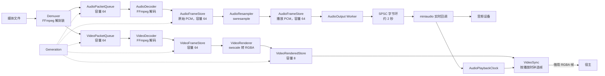
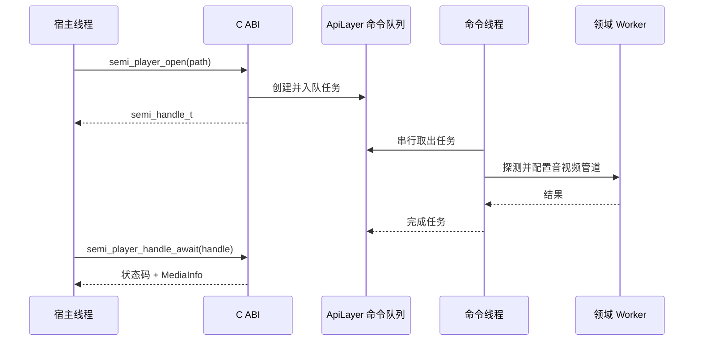

# SemiPlayer 当前实现架构

本文描述 `v0.1.0` 源码已经落地的架构，是阅读代码的当前事实基线。
尚未实现的字幕、GPU 链路、精确 Seek 等方向单独记录在
[roadmap.md](roadmap.md)，不在本文中作为已有能力描述。

## 1. 系统定位

SemiPlayer 是进程内单例的 C++23 播放器内核。它负责媒体探测、解封装、音视频
解码、音频重采样与输出、视频格式转换和音视频同步，通过 C ABI 将控制接口和
RGBA 视频帧回调暴露给宿主。

当前经过发布验证的宿主是 SDL3 示例，平台是 Windows x64；核心代码按后端契约
隔离 FFmpeg、miniaudio 等技术实现，为后续平台适配保留边界。

## 2. 分层与职责

| 层次 | 当前模块 | 职责 |
|---|---|---|
| 进程边界 | `api_export.cpp`、公开 C 头文件 | 生命周期、参数转换、状态码映射、C ABI 导出 |
| 应用层 | `ApiLayer` | 命令队列、句柄表、会话状态机、音视频管道编排 |
| 领域 Worker | Demuxer、AudioDecoder、AudioResampler、AudioOutput、VideoDecoder、VideoRenderer、VideoSync | 每个模块维护自己的会话状态和工作线程 |
| 领域资源 | PacketQueue、FrameStore、Generation | 有界数据传递、输入结束标记和跨会话数据隔离 |
| 后端契约 | `src/contracts/` | 将领域流程与 FFmpeg、音频设备实现解耦 |
| 基础设施 | FFmpeg 后端、miniaudio/NullAudio 后端、Notifier、日志 | 技术能力和平台接入 |
| 装配层 | `IoCContainer` | 构造期注入依赖、启动 ApiLayer、逆序释放模块 |

构建时，`semi_player_core` 是包含内部实现的静态库；`semi_player` 动态库只增加
C ABI 导出层并链接核心库。测试可以直接链接静态核心，ABI 测试则通过动态库边界
调用公开接口。

关键源码：

- [C ABI 导出](../src/api_export.cpp)
- [应用层命令中枢](../src/application/api_layer.cpp)
- [IoC 装配](../src/ioc/ioc_container.cpp)
- [公开接口](../include/semi_player/semi_player.h)

## 3. 当前数据流

音频和视频输入结束也作为带 `generation` 的队列数据项顺序传递，而不是通过一个
可能抢先到达的全局 EOF 控制信号。末端分别确认完成后，`ApiLayer` 才发布一次
`PlaybackFinished` 事件。

相关实现：

- [音频包队列](../src/domain/resource/audio_packet_queue/audio_packet_queue.hpp)
- [视频包队列](../src/domain/resource/video_packet_queue/video_packet_queue.hpp)
- [音频帧 Store](../src/domain/resource/audio_frame_store/audio_frame_store.hpp)
- [视频帧 Store](../src/domain/resource/video_frame_store/video_frame_store.hpp)
- [渲染帧 Store](../src/domain/resource/video_rendered_store/video_rendered_store.hpp)

## 4. 控制模型

宿主控制和媒体数据不共用通道。C ABI 的 `open`、`play`、`pause`、`seek`、`close`
和视频输出配置会创建任务并立即返回非零句柄；`ApiLayer` 的唯一命令线程按入队顺序
执行任务。

控制模型的具体语义：

- 最多保留 1024 个排队、运行或尚未消费结果的任务。
- `await` 阻塞到任务终态，复制结果并消费句柄。
- `cancel` 只接受尚未开始的任务；已经开始的 FFmpeg 操作会执行完成。
- 命令线程忠实执行队列，不自动合并连续 Seek。需要“只保留最新 Seek”时由宿主取消
  仍在排队的旧任务。
- `PlayerState` 当前包含 `Idle`、`Ready`、`Playing`、`Paused`、`Ended` 和 `Error`，
  命令执行前会检查状态合法性。

任务与状态机实现见 [ApiLayer](../src/application/api_layer.hpp)；公开句柄契约见
[C ABI 头文件](../include/semi_player/semi_player.h)。

## 5. Open、Play 与 Close 编排

### Open

1. 如果已有媒体，先按 Close 路径解除旧管道配置。
2. Demuxer 打开并探测媒体，选择默认音视频流；成功后推进 `Generation`。
3. 视频流依次配置 VideoRenderer、VideoDecoder 和 VideoSync。
4. 音频流依次配置 AudioDecoder、AudioOutput，再用解码格式和设备播放格式配置
   AudioResampler。
5. 保存本次媒体信息与预期完成的流，状态进入 `Ready`。

### Play / Pause

解码和转换 Worker 在配置完成后按队列可用性推进。`play` 与 `pause` 主要打开或关闭
末端消费阀门：AudioOutput 控制音频设备和消费，VideoSync 控制视频交付；上游最终
由有界队列背压自然停下或恢复。

重复 `play`、`pause` 和 `close` 是幂等成功，减少宿主状态抖动带来的额外分支。

### Close

Close 先停止 VideoSync 的帧交付，再关闭 Demuxer 停止新数据生产，随后解除视频
解码/转换与音频解码/重采样/输出配置。模块对象和它们的常驻 Worker 不销毁，因此
下一次 Open 可以复用同一套装配；只有 `shutdown` 才停止命令线程并逆序释放整套模块。

详细编排见 [Open](modules/api_layer/open.md)、[Play/Pause](modules/api_layer/play.md)
和 [Close](modules/api_layer/close.md)。

## 6. 线程模型

| 执行上下文 | 数量 | 主要职责 | 阻塞规则 |
|---|---:|---|---|
| 宿主调用线程 | 宿主决定 | 投递命令、等待句柄、轮询事件 | C ABI 投递本身不等待媒体操作 |
| ApiLayer 命令线程 | 1 | 串行执行控制命令和会话编排 | 可以等待领域控制命令完成 |
| Demuxer Worker | 1 | 读取并分流压缩包 | 输出队列满时等待 |
| AudioDecoder Worker | 1 | 解码音频 | 输入为空或输出满时等待 |
| AudioResampler Worker | 1 | 转换为设备播放格式 | 输入为空或输出满时等待 |
| AudioOutput Worker | 1 | 把 PCM 提交到 SPSC 环 | 环满时等待唤醒 |
| VideoDecoder Worker | 1 | 解码视频帧 | 输入为空或输出满时等待 |
| VideoRenderer Worker | 1 | 转换为宿主 RGBA 帧 | 输入为空或输出满时等待 |
| VideoSync Worker | 1 | 按时钟等待、选帧、调用宿主回调 | 不在持锁状态执行宿主回调 |
| miniaudio 回调 | 设备提供 | 从 SPSC 环取样并更新消费进度 | 不加业务锁、不等待；缺数据时输出静音 |

领域 Worker 各自维护 `WorkerState` 和 `SessionState`，控制命令通过模块私有队列进入
对应线程。状态不会集中到一个“上帝对象”；`ApiLayer` 的状态只用于对外命令合法性
和跨流完成汇聚。当前各 Worker 分别持有线程循环、控制队列和状态转换逻辑；待这些
机制的共同边界进一步稳定后，再统一评估公共抽象。

## 7. Generation：跨会话数据隔离

Seek 或媒体替换时，旧包、旧解码帧和旧 PCM 可能仍在多个有界队列中。若要求一个
协调者在精确时刻依次清空所有队列，会引入跨线程顺序依赖。

当前实现采用共享原子世代号：

1. 成功 Open 或 Demuxer 完成关键帧定位后调用 `Generation::bump()`。
2. Packet、Frame、PCM 和 EndOfInput 项都携带生成时的 `generation`。
3. 每个消费者在使用数据前与当前值比较，旧世代数据直接丢弃。
4. Worker 观察到世代变化时重置 FFmpeg 内部缓存、待输出项和本地时钟状态。

Notifier 发送的 `GenerationChanged` 只是唤醒提示；即使某次通知没有被观察到，Worker
仍会比较原子当前值，因此正确性不依赖通知必达。

Generation 只解决数据隔离，不等同于命令取消。Seek 已经开始后会运行完成；取消仍
只针对 ApiLayer 队列中尚未开始的任务。

实现见 [Generation](../src/domain/resource/generation/generation.cpp) 和
[Seek 编排](modules/api_layer/seek.md)。

## 8. 背压与通知

默认队列容量如下：

| 资源 | 默认容量 |
|---|---:|
| AudioPacketQueue | 64 项 |
| VideoPacketQueue | 64 项 |
| decoded AudioFrameStore | 64 项 |
| playback AudioFrameStore | 64 项 |
| VideoFrameStore | 64 项 |
| VideoRenderedStore | 8 项 |
| miniaudio SPSC 字节环 | 48 kHz、双声道、F32 下约 2 秒 |

所有 Queue/Store 的写入都是“整项接受或拒绝”，不会部分写入。上游保留待输出项并
等待 `NotFull`，下游等待 `NotEmpty`，从而把内存上界和流速控制落在局部模块。

普通 Worker 使用类型化 `Notifier` 发送边界变化。通知回调只设置 hint 并唤醒模块
自己的条件变量，Worker 醒来后必须重新检查真实谓词，所以通知不是数据通道。

miniaudio 实时回调不使用普通 Notifier，而通过固定单订阅者的实时通知器发布已消费
帧数；AudioOutput 的实时 sink 直接更新只含原子字段的播放时钟，并唤醒 Worker 处理
普通位置事件，避免实时线程进入通用分发和业务锁。

## 9. 音视频同步

有音频流时，AudioOutput 维护音频主时钟：首块 PCM 的 PTS 建立时间锚点，miniaudio
回调确认的已消费帧数推进位置。时钟状态使用原子字段发布，VideoSync 可以无业务锁
读取一致快照。

VideoSync 读取渲染帧 PTS 与当前播放位置：

- 帧时间未到：记录下一唤醒时刻并等待。
- 一次醒来已有多帧到期：保留最新到期帧，旧帧自然被丢弃。
- 暂停：冻结时钟和帧交付。
- Seek：采纳新 generation，丢弃 pending frame，并等待新音频位置。
- 纯视频媒体：使用 `steady_clock` 建立本地时钟。
- 音频先结束：从最后音频位置切换到本地时钟，让剩余视频继续播放。

具体实现见 [AudioPlaybackClock](../src/domain/worker/audio_output/audio_playback_clock.cpp)
和 [VideoSync](../src/domain/worker/video_sync/default_video_sync.cpp)。

## 10. 宿主视频帧边界

VideoRenderer 当前输出单平面 RGBA8888 CPU 帧。VideoSync 到点后同步调用宿主回调，
C ABI 只构造只读视图，不复制像素：

- `semi_video_frame_t` 和 plane 数据只在回调期间有效。
- 宿主必须在回调返回前完成纹理上传或复制。
- 回调运行在 VideoSync Worker，不应反向等待播放器控制命令。
- SDL3 示例先复制到宿主持有的 latest-frame mailbox，再向 SDL 主线程投递用户事件；
  SDL 渲染 API 始终留在主线程。

这条边界避免每帧在 C ABI 层额外复制，同时把 GPU/窗口线程规则留给宿主处理。详见
[视频输出契约](modules/video_output/video_output.md) 和
[SDL3 示例](../examples/sdl_player/README.md)。

## 11. 依赖装配与释放

`IoCContainer` 只在初始化阶段构造依赖，不作为运行时服务定位器：

1. 构造 Notifier、实时通知器、Generation、Queue 和 Store。
2. 构造 FFmpeg 与音频输出后端。
3. 将资源和后端契约注入 7 个领域 Worker。
4. 将领域模块注入 ApiLayer 并启动命令线程。
5. `shutdown` 时先停止 ApiLayer，再按依赖反序释放 Worker、资源和基础设施。

CI 通过编译选项将音频后端替换为 `NullAudioOutputBackend`，领域层和测试流程无需感知
机器是否存在声卡。这也是当前依赖反转边界的直接验证。

生命周期细节见 [lifecycle.md](lifecycle.md) 和
[IoCContainer](../src/ioc/ioc_container.cpp)。

## 12. 当前范围边界

`v0.1.0` 当前不包含：

- 字幕解码、光栅化与合成；
- GPU 硬件解码或 GPU 零拷贝帧交付；
- 目标时间戳级的精确 Seek；
- 倍速、音轨/字幕轨选择和公开音量控制；
- Windows x64 之外经过持续集成验证的发布包；
- 已公开的可复现性能基准。

这些方向的动机、阶段和验收条件见 [roadmap.md](roadmap.md)。
