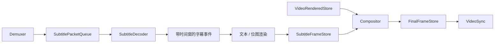

# SemiPlayer 路线图

本文记录尚未完成的方向，用于区分“当前能力”和“未来设计”。路线图表达优先级与
验收标准，不承诺固定发布日期；当前已实现架构见 [architecture.md](architecture.md)。

## 状态约定

| 状态 | 含义 |
|---|---|
| 近期 | 当前优先交付的能力或改进 |
| 中期 | 需要新增明确的用户能力或内部子系统 |
| 探索 | 需要先验证收益、接口和平台成本 |

当前基线为 `v0.1.0`；已实现能力、架构和性能结果分别见
[README](../README.md)、[architecture.md](architecture.md) 和
[performance.md](performance.md)，不在路线图中重复维护。

## 近期：精确 Seek

当前只支持前一个或后一个关键帧定位。精确 Seek 需要在 Demuxer 完成关键帧定位后：

- VideoDecoder 丢弃目标 PTS 之前的解码帧；
- AudioDecoder/AudioResampler 裁剪目标时间之前的 PCM；
- 重新建立 AudioPlaybackClock 锚点；
- 保持 Generation 对旧管道数据的隔离职责不变。

验收标准：对固定测试媒体请求任意时间点，首个视频帧和首段音频落在定义的误差范围
内，并覆盖播放态、暂停态和连续 Seek。

## 近期：展示收尾

- 在 GitHub 仓库设置中增加 Social Preview。

这项工作不影响播放器功能，也不需要修改播放器代码。

## 中期：播放控制扩展

### 音量与播放控制扩展

- 完成并公开音量控制语义；
- 设计静音和设备选择；
- 评估倍速与变速不变调，明确 AudioPlaybackClock 如何随速率变化。

公共 C ABI 需要保持结构体可扩展和旧宿主兼容，不直接暴露 C++ 类型。

### 轨道选择

当前 Demuxer 自动选择默认流。后续可在 MediaInfo 中暴露音轨、视频轨和字幕轨列表，
并用显式命令切换轨道。切换同样通过新 Generation 隔离旧数据。

## 中期：字幕链路

字幕不是在现有 VideoRenderer 中直接叠加，而是作为独立数据流接入：

设计约束：

- 字幕项携带 Generation，Seek 后旧事件自动失效；
- 文本字幕只在内容变化时光栅化，不按视频帧率重复渲染；
- Compositor 只负责合成，不承担解码、格式转换或时钟职责；
- 无字幕媒体不应为视频主链路增加不必要复制。

验收标准：至少覆盖 UTF-8 SRT、Seek 后字幕正确性、无字幕回归和时间窗边界测试。

## 探索：GPU 视频链路

GPU 优化分两个阶段评估，避免一次性把设备、FFmpeg 和宿主 API 耦合在一起。

### 阶段一：硬件解码 + CPU 回读

- 定义平台无关的设备契约；
- 由 FFmpeg VideoDecoder 持有具体 hwcontext；
- 解码后回读到 CPU，继续复用现有 VideoRenderer 和 C ABI RGBA 回调；
- 比较 CPU 占用下降与回读成本。

### 阶段二：GPU 零拷贝交付

- 设计带 API 类型、资源句柄和同步原语的版本化帧描述；
- 处理 D3D11/Vulkan 等平台差异、设备丢失和资源所有权；
- 让宿主直接消费 GPU 纹理，同时保留 CPU 回调兼容路径。

只有基准证明收益足以覆盖复杂度后才进入实现。不能把“使用硬解”与“端到端零拷贝”
混为同一能力。

## 探索：跨平台发布

核心代码和后端契约以跨平台为目标，但当前只持续验证 Windows UCRT64。后续顺序建议：

1. Linux + GCC/Clang 无窗口核心测试；
2. Linux SDL3 示例与音频设备集成；
3. macOS 构建与 CoreAudio 路径验证；
4. 各平台便携分发、许可证和代码签名策略。

验收标准不是“能够编译”，而是 CI 构建、完整测试和至少一个真实播放冒烟场景均通过。

## 探索：发布包精简与安全

- 定制 FFmpeg，只启用实际需要的协议、容器、编解码器和过滤能力；
- 比较精简前后的体积、格式覆盖和许可证闭包；
- 为 Windows 可执行文件和安装包增加代码签名；
- 发布 SBOM，并继续保留第三方许可证清单和哈希校验。

精简不能以删除必要许可证或破坏常见格式为代价，需配套格式回归测试。
